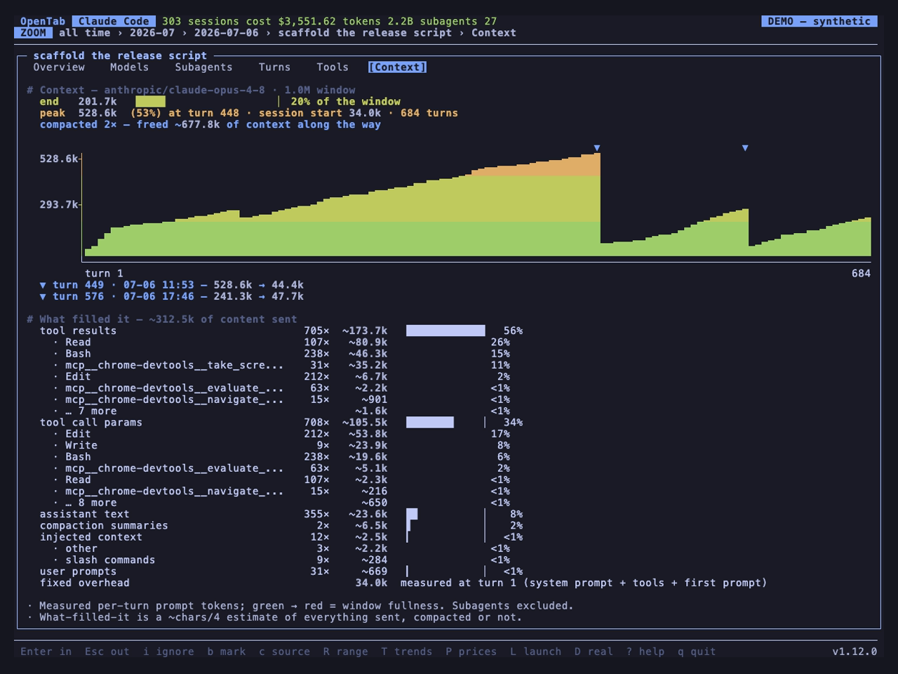

<h1 align="center">OpenTab</h1>

<p align="center"><em>Your AI coding tools keep a tab. OpenTab opens it.</em></p>

<p align="center"><strong>See where your coding agents spent their tokens, time, and money.</strong></p>

OpenTab brings the history your tools already keep into one interactive browser.
Follow a busy month into a project, a session, its subagents, and individual turns.
See what filled the context window. Compare the same token usage at another model's prices.

Works with **Claude Code, Codex, OpenCode, Copilot, [and more](#the-tools-it-reads)**.
Runs locally, in your **terminal or web browser**. No account, no telemetry, and your
agents' history stays read-only.

<p align="center">
  <a href="https://github.com/user-attachments/assets/49531f8f-606d-4dea-9918-6588e3c3e69e"></a>
  <br><sub><b>Find the session behind the spike.</b> Explore the calendar and drill from a month into the work behind it. Anonymized demo data; click for the full-quality video.</sub>
</p>

## Try it on your own history

<a id="install"></a>

```sh
pipx install opentab-ai
opentab
```

OpenTab discovers supported tools' local records and brings them together automatically.
Start with a recent day, open **Sessions**, and pick one you remember. Press **Enter** to
drill in, **Esc** to step back, and **?** for the keys that work where you are. The mouse
works too.

On a subscription? You can still explore your usage: OpenTab starts with clearly labeled
API-equivalent estimates for tokens that have no recorded cost. **`$`** switches to
recorded spend. [How the money works](#about-the-money).

Python **3.9+** · macOS · Linux · WSL · native Windows.

<details>
<summary><strong>More ways to install and upgrade</strong></summary>

The PyPI package is **`opentab-ai`**; the command is **`opentab`**.

```sh
brew install hamidi-dev/tap/opentab         # Homebrew (macOS / Linux)
pip install --user opentab-ai               # pip
curl -fsSL https://raw.githubusercontent.com/hamidi-dev/opentab/main/install.sh | bash
```

Upgrade with `pipx upgrade opentab-ai`, `brew upgrade opentab`, or
`pip install -U --user opentab-ai`.

The runtime uses Python's standard library, with `windows-curses` added automatically
on native Windows. [Windows & WSL setup](docs/windows.md).

</details>

<a id="usage"></a>

Prefer a browser? Run **`opentab web`**. Showing someone your screen? **`opentab --demo`**
anonymizes your existing history in memory. If a tool is missing, **`opentab doctor`**
explains what was found and what needs attention.

Automating it? OpenTab also provides versioned JSON resource commands and a local
stdio MCP server: `opentab usage summary --range 30d` and `opentab mcp`. See
[Programmatic access](docs/programmatic.md) for commands, schemas, and privacy gates.

## Follow the work behind the numbers

<a id="what-you-get"></a>

### Follow an expensive session down to the turn

Pick a day on the spend heatmap. Open its sessions, sort by cost, and follow the largest
one. The **Subagents** view shows how the work's cost splits between the main agent and
its delegates, including nested subagents. You can see whether one delegate accounts for
most of the total or the cost is spread across the team.

Then open **Turns**: prompts, the steps that followed, and their token usage and cost in
order. On supported tools, inspect a turn's recorded narration, reasoning, and exact tool
calls and results right in the terminal.
Use **`[` / `]`** to move between turns. Tool results start as compact previews;
click a result or press **Enter** to expand the output marked `▸` (the section at
the top of the viewport, or the next below it). **`z`** expands the whole turn,
including full arguments and output.

The **Tools** view groups usage by tool and MCP server. Its treemap separates tools that
ran often from those associated with expensive calls, with exact figures underneath.
Attribution comes from the model turns that used each tool; calls in the same turn share
that turn's usage.

### Understand why token counts and costs tell different stories

A large token count is only the beginning. **Token economics** puts each token type's
share of the volume beside its share of the cost at API list rates: uncached input,
output, reasoning, cache reads, and cache writes.

See how much of your usage is cached, and which token types account for the money.
Drill into a model within a month or project to see its own economics and the sessions
that used it, ranked by that model's contribution.

### See what filled the context window

The **Context** view follows the window as it grows, marks compactions, and estimates
what went into it: tool results, call arguments, assistant text, prompts, and more.
See when the context shrank and what it grew back to.

<p align="center">
  
  <br><sub><b>Two compactions, and the context fills again.</b> The curve shows when; the breakdown shows what was sent. Anonymized demo data.</sub>
</p>

Session lists also show **Worked** time where the records support it: the agent's
working bursts, with idle waits for your next prompt removed.

### Put another model's prices against your actual usage

Press **`w`**, choose a model, and open a session. Compare the list-price cost of the
models it used with the cost of those same tokens at your chosen model's rates. Sessions
with subagents also show the target price beside each agent's usage.

Explore models you've used or the full bundled catalog. **`P`** compares model and
provider rates using **your token mix**, including cache usage, and lets you pin a
shortlist. Both sides of a session comparison use list rates; it holds token usage fixed
and makes no prediction about another model's output quality or how many tokens it would use.

Detail views depend on what each tool records. [Compare support below](#the-tools-it-reads).

## Built to be poked at

Move between daily, weekly, and monthly trends, a calendar heatmap, and rankings of
models, providers, projects, and coding tools. Follow a chart or a ranking into the
sessions behind it. Filter as you type, change the date range, and keep exploring.

- **Find your way back.** Bookmark sessions, add searchable notes, and reopen supported
  sessions in their original coding tool with **`L`**. Launch through tmux, Herdr, or a
  custom launcher, or copy a ready-to-run resume command.
- **Make it yours.** Keyboard and mouse navigation, 30 bundled themes, and remappable
  keys. Your range, sort, selected tool, theme, bookmarks, and pricing view are remembered.
- **Take a view with you.** Press **`e`** to export the current list to CSV, including
  the filters and scope you've chosen.

[Keys & navigation](docs/keys.md) · [Watch the full narrated tour on YouTube](https://www.youtube.com/watch?v=EsJPw4y5zgU)

## In your terminal. In your browser. In one file.

```sh
opentab web                        # open the live browser on localhost
opentab --html report.html          # write a self-contained report
opentab --demo --html demo.html    # anonymize it for sharing
```

The web browser shares the TUI's navigation, themes, trends, and model comparisons.
The live version fetches Turns, Tools, and Context on demand where supported. The HTML
export packages the overview and comparison views into **one file you can open offline**,
with no server or dependencies. Links to months, days, and sessions let someone open the
part you want to show them.

<p align="center">
  
  <br><sub><b>Keep exploring in the browser.</b> The same history, with familiar keys and clickable tables.</sub>
</p>

Turn traces and personal notes are absent from web reports; the TUI and gated
[CLI/MCP API](docs/programmatic.md#raw-content) provide separate access. The static
HTML report omits the live Turns, Tools, and Context tabs.
[Web browser & exports](docs/web.md).

<a id="fleet"></a>

## Every machine, one tab

Your laptop, workstation, and remote box can all contribute to the same view.
**`opentab pull`** gathers their usage summaries over SSH and opens them together with
this machine's history. Filter any view by machine, compare projects across boxes, or
reopen a supported session on the machine where it ran.

```sh
opentab pull laptop workstation gpu-box
opentab pull                              # refresh your saved machines next time
opentab remote                            # browse the last pull without reconnecting
```

Each remote needs `opentab` on its `PATH`. **No background agent or listening service**
is needed for SSH pulls. Summaries contain no raw traces. Opening a supported remote
turn in the TUI explicitly fetches just that turn over SSH; `Esc` cancels, and closing
and reopening retries a failed read. Ordinary browsing stays offline. Remote traces
need a managed cached summary, saved SSH connection and compatible remote OpenTab CLI.

[SSH setup, portable exports, and managing machines](docs/machines.md).

## Live prices in your sidebar

Keep an eye on a session while it runs. [**herdr-opentab**](https://github.com/hamidi-dev/herdr-opentab)
puts each running agent's cost beside it in the [Herdr](https://herdr.dev) sidebar,
subagents included.

For your own status bar or script, **`opentab cost "$PWD"`** prints the latest session's
cost for that project. **`opentab --goto "$PWD"`** opens that session for inspection.

<details>
<summary><strong>See the Herdr integration</strong></summary>

<p align="center">
  
  <br><sub>Amounts synthetic, everything else real.</sub>
</p>

</details>

## The tools it reads

[OpenCode](https://opencode.ai) · [Claude Code](https://claude.com/claude-code) ·
[Codex CLI](https://developers.openai.com/codex) ·
[GitHub Copilot](https://github.com/github/copilot-cli) (CLI and Copilot Chat in VS Code) ·
[pi-agent](https://pi.dev) · [omp](https://omp.sh) ·
[OpenClaw](https://github.com/openclaw/openclaw) · [zaly](https://github.com/folke/zaly) ·
[Gemini CLI](https://github.com/google-gemini/gemini-cli) ·
[Antigravity](https://antigravity.google/) · [Hermes](https://hermes-agent.nousresearch.com/) ·
and **CSV/JSONL logs** of your own API requests.

Use **`H`** to switch tools live, or `opentab --harness NAME` to start with one.
You can also hand it a file: `opentab requests.csv` or `opentab path/to/opencode.db`.

<details>
<summary><strong>What each tool's records support on top</strong> — cost, subagent tree, Turns, Trace, Tools, Context</summary>

| Harness | Cost | Subagent tree | Turns | Trace | Tools | Context |
|--------|------|:---:|:---:|:---:|:---:|:---:|
| OpenCode | real recorded | ✓ | ✓ | ✓ | ✓ | ✓ |
| Claude Code | tokens only — `$` estimates | ✓ | ✓ | ✓ | ✓ | ✓ |
| Codex CLI | tokens only — `$` estimates | ✓ | ✓ | ✓ | ✓ | — |
| Hermes Agent | mixed — metered real, rest estimated | ✓ | ✓ | ✓ | ✓ | ✓ |
| GitHub Copilot CLI | tokens only — `$` estimates | — | ✓ | — | — | ✓ |
| Copilot Chat in VS Code | tokens only — `$` estimates | — | ✓ | — | — | ✓ |
| pi-agent | mixed — metered real, rest estimated | — | ✓ | ✓ | ✓ | ✓ |
| omp | mixed — metered real, rest estimated | ✓ | ✓ | ✓ | ✓ | ✓ |
| OpenClaw | mixed — metered real, rest estimated | — | ✓ | ✓ | ✓ | ✓ |
| zaly | mixed — metered real, rest estimated | — | ✓ | ✓ | ✓ | ✓ |
| Gemini CLI | tokens only — `$` estimates | ✓ | ✓ | ✓ | ✓ | ✓ |
| Antigravity | tokens only — `$` estimates | ✓ | ✓ | — | ✓ | ✓ |
| CSV / JSONL request logs | mixed — per-row cost column | — | ✓ | — | ✓ | ✓ |

**Subagent tree** — recursive per-subagent cost under the session that delegated ·
**Turns** — the per-turn cost timeline · **Trace** — one turn's recorded narration,
reasoning and exact calls/results, local to the TUI · **Tools** — token attribution per
tool call and MCP server · **Context** — the context-window growth curve (it rides on
Turns). A `—` means the required data or a safe mapping is unavailable; sources.md says
which, and why, for each one.

</details>


[Data locations, setup, and the CSV/JSONL schema](docs/sources.md). Some tools need setup,
such as Copilot CLI's opt-in telemetry export; `opentab doctor` helps you find the gaps.

> [!TIP]
> **Keep the history you want to explore.** Claude Code and Gemini CLI can delete old
> local records automatically. OpenTab can only show what remains on disk.
> [Check your retention settings](#keep-your-history).

## About the money

**Recorded spend** comes from your tools' own records. A subscription session can record
millions of tokens and `$0.00` of per-token cost; your subscription is billed elsewhere.

**API-equivalent estimates** add list-price costs for that unpriced usage. This view is
on by default and your choice is remembered; **`$`** toggles it. Model rates ship in a
bundled models.dev catalog, so ordinary browsing works offline. Refresh them when you
choose with **`r`** in the **`P`** price table or `opentab --refresh-models`.

Estimates help you compare usage. Your provider's invoice may include subscriptions,
discounts, credits, or markups that local records cannot tell OpenTab about.
[Pricing explained](docs/pricing.md).

## FAQ

<details>
<summary><strong>Does any of this leave my machine?</strong></summary>

Local browsing needs no cloud service or account and sends no telemetry. Your agents'
files are opened read-only; OpenTab writes its own preferences, notes, caches, and the
exports you request.

You control transfers: remote pulls fetch summaries from machines you choose, a price
refresh fetches the models.dev catalog, and exports go wherever you put them. The live
web browser binds to localhost by default. [Privacy details](docs/privacy.md).

</details>

<details>
<summary><strong>Can I show it without exposing my project names and prompts?</strong></summary>

Use `opentab --demo`, or **`D`** in-app, to anonymize titles, paths, prompt text, and
absolute spend/token numbers in memory. The shape of the data stays real. Demo mode
never writes those changes back to your history or saves your browsing state.

`opentab --demo --html demo.html` creates an anonymized report. You can also choose
which categories to scramble; [demo mode details](docs/privacy.md#demo-mode).

</details>

<a id="keep-your-history"></a>

<details>
<summary><strong>How do I keep a longer history?</strong></summary>

Claude Code deletes local transcripts after **30 days** by default, and Gemini CLI's
default retention removes chat recordings older than **30 days** on launch. Once the
source record disappears, its usage disappears from OpenTab too. OpenTab warns about
these settings; `opentab doctor` reports them.

For long history:

- Claude Code: add `"cleanupPeriodDays": 3650` to `$CLAUDE_CONFIG_DIR/settings.json`
  (default `~/.claude/settings.json`).
- Gemini CLI: set `"general": {"sessionRetention": {"enabled": false}}` in
  `~/.gemini/settings.json`, merging it with any existing `general` settings.

</details>

<details>
<summary><strong>My tool isn't supported. Can I still use OpenTab?</strong></summary>

If it can log API requests, point OpenTab at a CSV or JSONL of them. Turns, Tools, and
Context become available when the log carries the relevant optional fields.
[Request log schema](docs/sources.md#schema).

For another native integration, open an issue describing the tool and its record format.

</details>

## Something looks off?

Run **`opentab doctor`**. It reports which tools it found, why others are missing, and
what to fix, along with terminal support and the price catalog. It diagnoses without
repairing or reading transcript content.

[Full documentation](docs/README.md) · [Troubleshooting](docs/troubleshooting.md) ·
[Windows & WSL](docs/windows.md)

## Development

CI runs Ruff, unit tests, and ShellCheck. [CONTRIBUTING.md](CONTRIBUTING.md) covers setup,
checks, and commit conventions; [Architecture](docs/architecture.md) explains the code.

## License

MIT — see [LICENSE](LICENSE).
